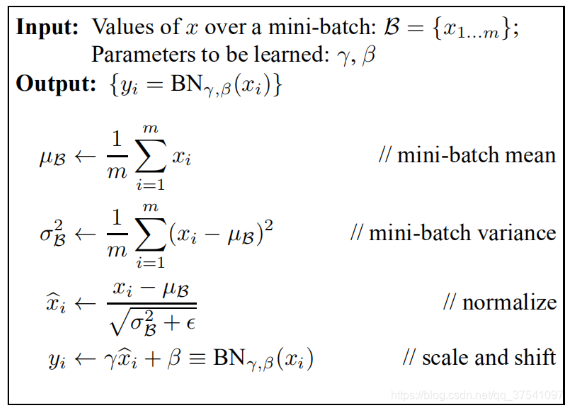
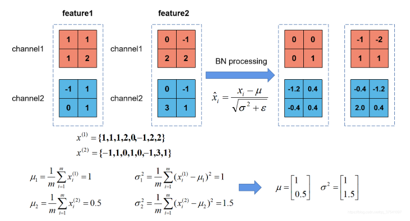
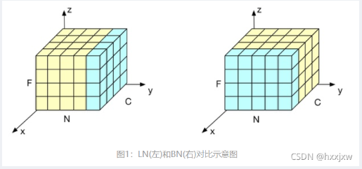

#### 2.2 Batch Normalization

##### 2.2.1 原理

在对图像预处理的过程中，通常会对图像进行标准化处理（均值为0，方差为1），这样能够加速网络的收敛。Batch Normalization的目的就是使图像处理过程中的feature map满足均值为0，方差为1的分布规律。理论上来说Normalization是要对整个训练样本集所对应的feature map的数据满足规律，但由于整个样本集数量太大，故出现Batch Normalization，只对同一批次的样本进行处理。

**具体公式如下：**

**示例如下：**

**注意**：

- batch越大，越接近整个数据集的分布，效果越好
- 计算的 $\mathrm{\mu}$，$\mathrm{\sigma}$，是一个向量，向量的维度在图像中可以理解为channel的数量
- 训练时将tranning参数设置为True，在验证时将tranning参数设置为False，使用model.train()和model.eval()方法控制
- 建议将bn层放置到卷积层和激活层之间，且卷积层不要使用偏置

#### 2.3 Layer Normalization

##### 2.3.1 对比

##### 2.3.2为什么时序特征用LN而不用BN

因为时序特征一个batch里面序列有长有短，特征不能够对齐。如果使用BN,由于为了补齐长短不一的样例而添加进去的0使得较长序列中词语的含义向量规模相对变小，较短序列中的词转换为含义向量的规模相对变大。平白无故增添了误差抖动。

##### 2.3.3 注意

- LayerNorm中不会像BatchNorm那样跟踪统计全局的均值方差，因此train()和eval(对LayerNorm没有
  影响其实在eval模式下，只有BatchNorm会屏蔽，其他Norm函数不会屏蔽