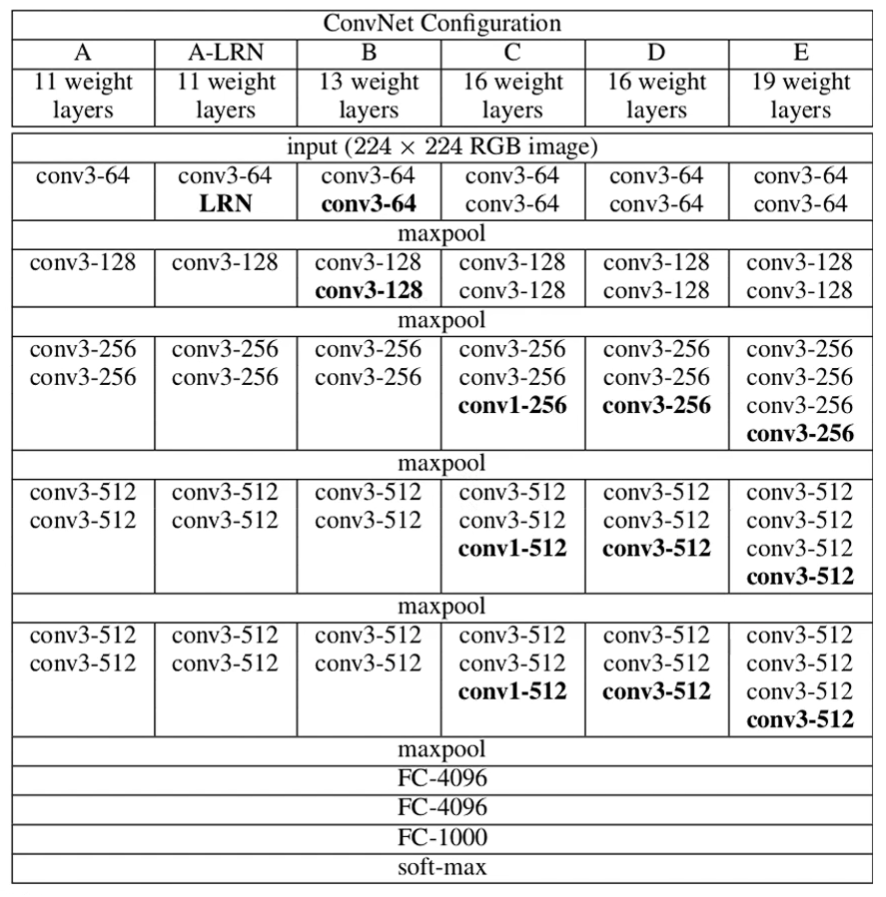
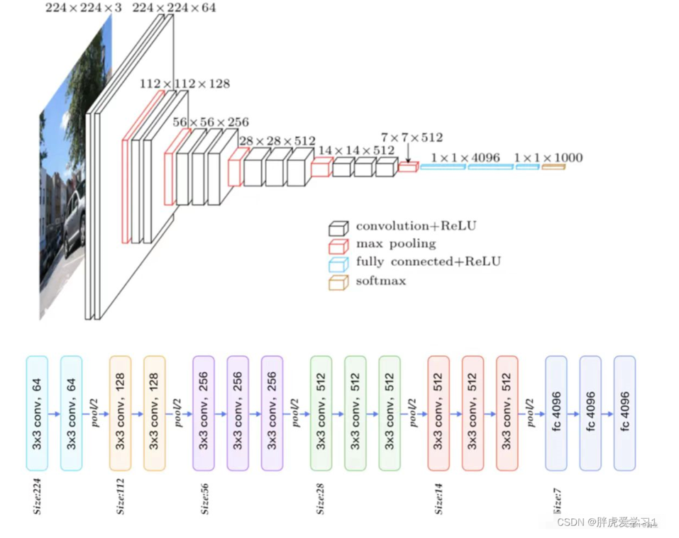
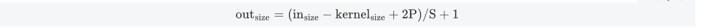
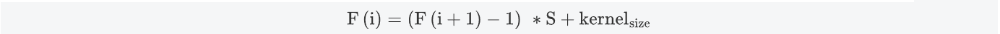
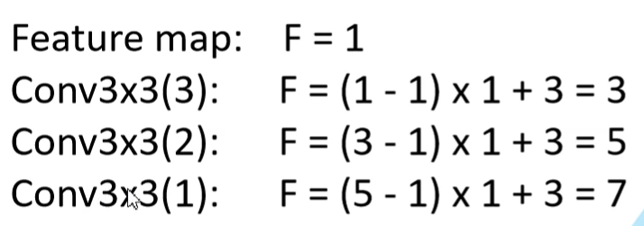

## VGG

### 1 Vgg 网络结构

最常使用的是VGG16

相比Alexnet ，VGG使用了更深的网络结构，证明了增加网络深度能够在一定程度上影响网络性能。

LRN：局部归一化

### 2 VGG的优点

- 小卷积核组：作者通过堆叠多个3 x 3 的卷积核来替代大的卷积核，来减少所需参数
- 卷积核专注于扩大通道数，池化层专注于缩小高和宽，模型越深，计算量的增加不断放缓
- 多尺度：作者从多尺度训练可以提升性能受到启发，训练和测试时使用整张图片的不同尺度的图像，以提高模型的性能

#### 2.1 感受野

在神经网络中，决定某一层输出结果中一个元素所对应的输入层区域的大小，被称作**感受野**。通俗解释是，输出feature map 上的一个单元对应输入层上的区域的大小。

##### 计算公式

经过卷积核之后，图像的大小

所以感受野的计算公式为

> 论文中提到，可以通过堆叠两个3x3的卷积核替代5x5的卷积核，堆叠三个3x3的卷积核替代7x7的卷积核。

##### 2.1 计算量

堆叠小卷积核相比使用大的卷积核具有更多的激活函数，更丰富的特征。另外参数量也会减少，3个3x3的卷积核参数量为3x(3x3xC)=27C，一个7x7的卷积核参数量为7x7xC=49C。
